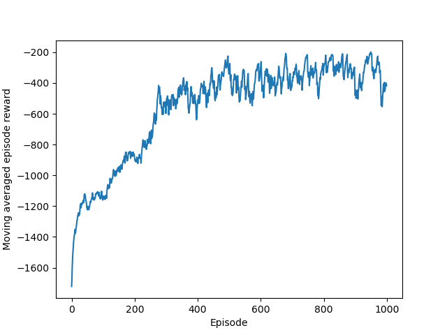
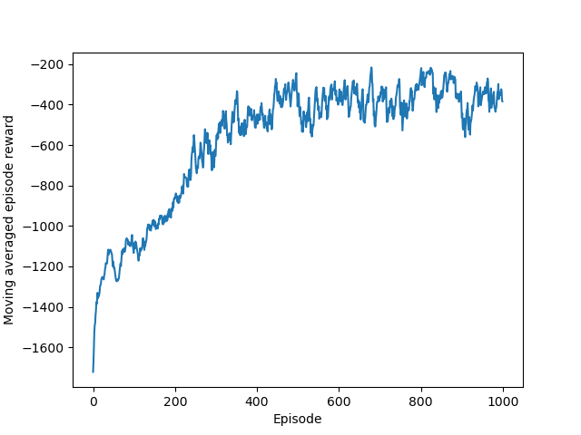
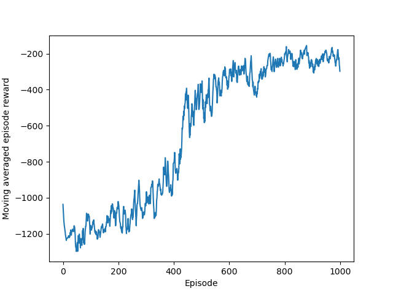

# PPO
PPO algorithm with KL penalty or Clip - Pendulum game

# Algorithm Principle
PPO算法基本原理（李宏毅课程学习笔记）_好程序不脱发的博客-CSDN博客  

https://blog.csdn.net/ningmengzhihe/article/details/131457536

PPO算法基本原理及流程图（KL penalty和Clip两种方法）_ppo算法流程图_好程序不脱发的博客-CSDN博客  

https://blog.csdn.net/ningmengzhihe/article/details/131459848

# Software Version
gym 0.26.2

pytorch

# Project Profile
PPO算法玩Pendulum小游戏

- PPO_clip_ok.py —— 带有Clip更新神经网络策略的PPO算法，玩Pendulum小游戏

实验结果如下：

- PPO_kl_pen_ok.py —— 带有KL Penalty更新神经网络策略的PPO算法，玩Pendulum小游戏

实验结果如下：

- PPO2_with_memory_ok.py —— 带有memory缓存的PPO算法实现，只需要一个Actor网络就可以了

实验结果如下：

